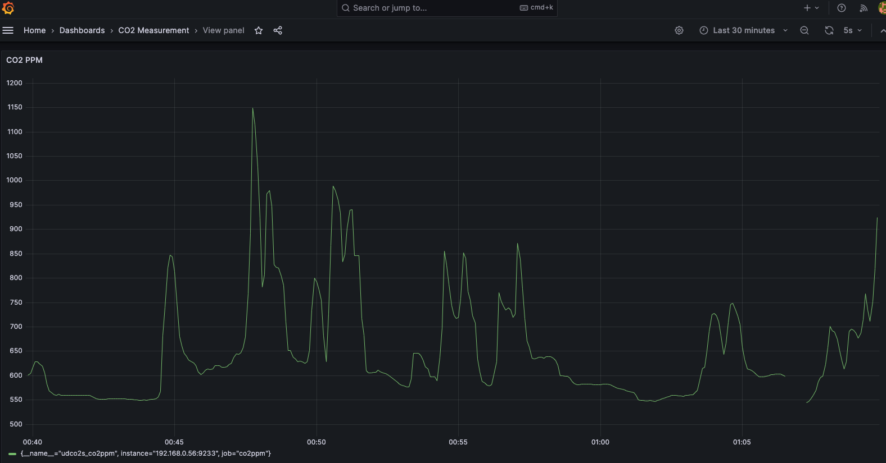

# UD-CO2S Monitoring
Graph visualization of CO2 ppm data measured by [UD-CO2S](https://www.iodata.jp/product/tsushin/iot/ud-co2s/) censor device.

## tech stack
rust
prometheus
grafana

## How to run
1. Initiate prometheus exporter.
```
cargo run -- --port=<device path for serial port> --addr=<your local ip address. Not like '127.0.0.1:9336'>
```


2. write your pc address in targets config of prometheus.yml. (use command: ifconfig).
3. Intialte prometheus and grafana server. 
```
docker-compose up -d
```
4. You should view grafana dashboard page by accessing localhost:3000.


